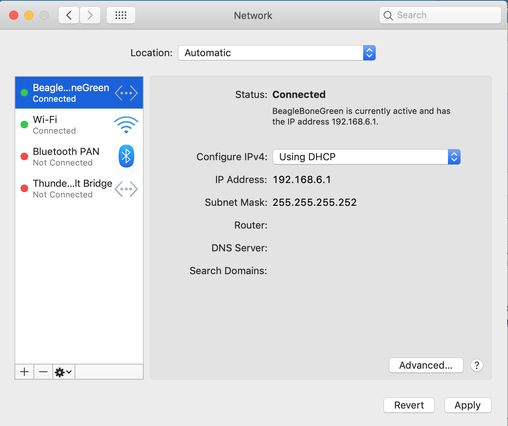

# My trouble shooting journey with MRAA library after flashing beaglebone

This is my experience debugging beaglebone and the MRAA library for my CS111 class Winter 2019.

When I am dealing with beaglebone, I am using:

* macOS Mojave Version 10.14.3
* Beaglebone Debian Image 9.5 2018-10-07 4GB SD IoT
* MRAA release v2.0.0

__TLDR: If you flash your beaglebone with the latest image, you need to build and install mraa library with special patching.__

Before I start, disclaimer: 
__you shall be 100% responsible for any outcome for installing and messing with the MRAA.__
__I have no obligation or responsibility for any damage caused your own beaglebone (or not passing the test scripts). If you disagree, please stop reading.__

Hi there,

If you are a Mac user like me, you might have experienced some issue with connection over USB issue. You might have written a new OS image to the disk following some guide like this one (http://wiki.seeedstudio.com/BeagleBone_Green_Wireless/#update-to-latest-software). 

After flashing (and installing the drivers), if you open up your Network Preference in Mac, you should be able to see the Beaglebone as a USB network connection.



If so, you should be able to use ssh debian@192.168.2.1 and operate on the Beaglebone! For the latest image found on the URL above, the image comes with the user "debian" and the default password seems to be "temppwd". 

When you get excited and start trying the mraa library, you get some error shown here. 
```
runTempSense.c:15:18: fatal error: mraa.h: No such file or directory
 #include "mraa.h"
                  ^
compilation terminated.
```

This means that the mraa library is not available by default on the new debian image. So, I ended having to install the library. The github page of mraa (https://github.com/intel-iot-devkit/mraa) offers a way to install the library in Ubuntu. Like this:

```
sudo add-apt-repository ppa:mraa/mraa
sudo apt-get update
sudo apt-get install libmraa2 libmraa-dev libmraa-java python-mraa python3-mraa node-mraa mraa-tools
```

However, you quickly realized this does not work. You get errors like this:

```
gpg: keybox '/tmp/tmpgx_w6m39/pubring.gpg' created
gpg: /tmp/tmpgx_w6m39/trustdb.gpg: trustdb created
gpg: key 579A863339B88DE4: public key "Launchpad PPA for mraa" imported
gpg: Total number processed: 1
gpg:               imported: 1
gpg: no valid OpenPGP data found.
```

 I do not know Linux and apt-get enough to know why. Maybe someone else (wink-wink (¬‿¬)) can help answer this question.

Since apt-get does not do its job, I found there is a guide on the github page to build the library from source (https://github.com/intel-iot-devkit/mraa/blob/master/docs/building.md). Why don't we do that instead? 

After some trial and error, here are the steps I got through to build and install the mraa library.

### Step 0.
Git clone the mraa library onto your laptop first, then scp the folder to beaglebone. 
(You can directly clone the repo onto the beagloebone, but I do this instead because wireless network is slow on Beaglebone and it becomes a bottleneck) 

### Step 1.
```bash
$ sudo apt-get install git build-essential swig3.0 cmake libjson-c-dev
```
These are just dependencies required to build the library. You might notice I skipped some dependencies like `python-dev`/`nodejs-dev` as shown in the guide. The reason is that we don't need python and node binding for this library. But it would be quite cool with someone build an actual iOT device with a django/nodejs server running on the beaglebone. 

### Step 2.
You need to cd into the directory of the mraa repo. 
Then,
```bash
$ mkdir build
$ cd build
$ cmake .. -DBUILDSWIGNODE=OFF -DBUILDSWIGPYTHON=OFF
$ make
$ sudo make install 
```
This make/install process is just the same-old-way we learned in CS35L. But with cmake that makes it easier. (again, not super familiar with cmake someone else might explain this better)
You might notice that I passed 2 flags `-DBUILDSWIGNODE=OFF` `-DBUILDSWIGPYTHON=OFF` to `cmake`. This prevents the build script from building the python and node bindings, as said above we don't need them.

### Step 3.

```bash
$ sudo ldconfig -v
```
This step makes the system aware of the newly installed mraa library is available and system will use it during dynamic linking. 
To make sure this works,
```bash
$ sudo ldconfig -v | grep libmraa.so.2
#outputs:
	libmraa.so.2 -> libmraa.so.2.0.0
```

You should now be able to compile code with reference to the mraa library header files. 
**However, this is not enough!**

## **((ノಠ益ಠ)ノ彡┻━┻)**

If you try to run the simple example with a button and a buzzer, shown in the link given by the spec, aka this one (https://drive.google.com/drive/folders/0B6dyEb8VXZo-N3hVcVI0UFpWSVk), you realize neither is your button nor your buzzer working. Why?

I outputted the debug messages from the mraa library through this command.

```
$ journalctl -t libmraa
Mar 06 10:56:17 uid.lasr.cs.ucla.edu libmraa[2188]: libmraa version v2.0.0-29-g7f8d387 initialised by user 'debian' with EUID 1000
Mar 06 10:56:17 uid.lasr.cs.ucla.edu libmraa[2188]: gpio: platform doesn't support chardev, falling back to sysfs
Mar 06 10:56:17 uid.lasr.cs.ucla.edu libmraa[2188]: libmraa initialised for platform 'Beaglebone Black Rev. B' of type 6
Mar 06 10:56:17 uid.lasr.cs.ucla.edu libmraa[2188]: gpio: init: pin 62 not capable of gpio
Mar 06 10:56:17 uid.lasr.cs.ucla.edu libmraa[2188]: gpio: init: pin 60 not capable of gpio
Mar 06 10:56:17 uid.lasr.cs.ucla.edu libmraa[2188]: gpio: dir: context is invalid
Mar 06 10:56:17 uid.lasr.cs.ucla.edu libmraa[2188]: gpio: dir: context is invalid
Mar 06 10:56:17 uid.lasr.cs.ucla.edu libmraa[2188]: gpio: isr: context is invalid
Mar 06 10:56:17 uid.lasr.cs.ucla.edu libmraa[2188]: gpio: write: context is invalid
Mar 06 10:56:18 uid.lasr.cs.ucla.edu libmraa[2188]: gpio: write: context is invalid
Mar 06 10:56:19 uid.lasr.cs.ucla.edu libmraa[2188]: gpio: write: context is invalid
```
Well, it is saying GPIO_50 (pin 60) and GPIO_51(pin 62) does not support GPIO. How is that possible?

Just to see the pin to GPIO mapping, you can do this
```bash
$ mraa-gpio list
# omitted outputs...
60      EHRPWM1A: PWM
61      GPIO48: GPIO
62      EHRPWM1B: PWM
# omitted outputs...
```

This is weird, it is saying that pin 60 and 62 is only capable of doing PWM instead of GPIO.

After going through the code base of the mraa library, 2 important things got my attention.
First, the `mraa_pincapabilities_t` type definition,
in `/include/mraa_internal_types.h`
```c
/**
 * A bitfield representing the capabilities of a pin.
 */
typedef struct {
    /*@{*/
    mraa_boolean_t valid:1;     /**< Is the pin valid at all */
    mraa_boolean_t gpio:1;      /**< Is the pin gpio capable */
    mraa_boolean_t pwm:1;       /**< Is the pin pwm capable */
    mraa_boolean_t fast_gpio:1; /**< Is the pin fast gpio capable */
    mraa_boolean_t spi:1;       /**< Is the pin spi capable */
    mraa_boolean_t i2c:1;       /**< Is the pin i2c capable */
    mraa_boolean_t aio:1;       /**< Is the pin analog input capable */
    mraa_boolean_t uart:1;       /**< Is the pin uart capable */
    /*@}*/
} mraa_pincapabilities_t;
```

Second, the mapping of GPIO_50 and GPIO_51.

in `/src/arm/beaglebone.c`
```C
    if (ehrpwm1a_enabled == 1) {
        strncpy(b->pins[BUILD_PIN(P9, 14)].name, "EHRPWM1A", MRAA_PIN_NAME_SIZE);
        b->pins[BUILD_PIN(P9, 14)].capabilities = (mraa_pincapabilities_t){ 1, 0, 1, 0, 0, 0, 0, 0   };
    } else {
        strncpy(b->pins[BUILD_PIN(P9, 14)].name, "GPIO50", MRAA_PIN_NAME_SIZE);
        b->pins[BUILD_PIN(P9, 14)].capabilities = (mraa_pincapabilities_t){ 1, 1, 1, 0, 0, 0, 0, 0 };
    }


    if (ehrpwm1b_enabled == 1) {
        strncpy(b->pins[BUILD_PIN(P9, 16)].name, "EHRPWM1B", MRAA_PIN_NAME_SIZE);
        b->pins[BUILD_PIN(P9, 16)].capabilities = (mraa_pincapabilities_t){ 1, 0, 1, 0, 0, 0, 0, 0 };
    } else {
        strncpy(b->pins[BUILD_PIN(P9, 16)].name, "GPIO51", MRAA_PIN_NAME_SIZE);
        b->pins[BUILD_PIN(P9, 16)].capabilities = (mraa_pincapabilities_t){ 1, 1, 1, 0, 0, 0, 0, 0 };
    }
```

We see the weird names (EHRPWM1A and EHRPWM1B) given to the pins 60 and 62 come from here. And if we read the mapping carefully we see that, the gpio capability bit is set to 0. 

However, the correct names are given in the else-block. So I attempted to comment out the if block so the else-block executes instead. After changing the source, I rebuilt the library again with the same command as above. 
I generated a patch and you can patch it and rebuild. 

You can copy the diff file here and save it.
```diff
diff --git a/src/arm/beaglebone.c b/src/arm/beaglebone.c
index cfd68c0..fd81210 100644
--- a/src/arm/beaglebone.c
+++ b/src/arm/beaglebone.c
@@ -1061,13 +1061,13 @@ mraa_beaglebone()
     b->pins[BUILD_PIN(P9, 13)].gpio.mux_total = 0;
     b->pins[BUILD_PIN(P9, 13)].uart.mux_total = 0;
 
-    if (ehrpwm1a_enabled == 1) {
-        strncpy(b->pins[BUILD_PIN(P9, 14)].name, "EHRPWM1A", MRAA_PIN_NAME_SIZE);
-        b->pins[BUILD_PIN(P9, 14)].capabilities = (mraa_pincapabilities_t){ 1, 0, 1, 0, 0, 0, 0, 0 };
-    } else {
+//    if (ehrpwm1a_enabled == 1) {
+//        strncpy(b->pins[BUILD_PIN(P9, 14)].name, "EHRPWM1A", MRAA_PIN_NAME_SIZE);
+//        b->pins[BUILD_PIN(P9, 14)].capabilities = (mraa_pincapabilities_t){ 1, 0, 1, 0, 0, 0, 0, 0 };
+//    } else {
         strncpy(b->pins[BUILD_PIN(P9, 14)].name, "GPIO50", MRAA_PIN_NAME_SIZE);
         b->pins[BUILD_PIN(P9, 14)].capabilities = (mraa_pincapabilities_t){ 1, 1, 1, 0, 0, 0, 0, 0 };
-    }
+//    }
     b->pins[BUILD_PIN(P9, 14)].gpio.pinmap = 50;
     b->pins[BUILD_PIN(P9, 14)].gpio.parent_id = 0;
     b->pins[BUILD_PIN(P9, 14)].gpio.mux_total = 0;
@@ -1081,13 +1081,13 @@ mraa_beaglebone()
     b->pins[BUILD_PIN(P9, 15)].gpio.parent_id = 0;
     b->pins[BUILD_PIN(P9, 15)].gpio.mux_total = 0;
 
-    if (ehrpwm1b_enabled == 1) {
-        strncpy(b->pins[BUILD_PIN(P9, 16)].name, "EHRPWM1B", MRAA_PIN_NAME_SIZE);
-        b->pins[BUILD_PIN(P9, 16)].capabilities = (mraa_pincapabilities_t){ 1, 0, 1, 0, 0, 0, 0, 0 };
-    } else {
+//    if (ehrpwm1b_enabled == 1) {
+//        strncpy(b->pins[BUILD_PIN(P9, 16)].name, "EHRPWM1B", MRAA_PIN_NAME_SIZE);
+//        b->pins[BUILD_PIN(P9, 16)].capabilities = (mraa_pincapabilities_t){ 1, 0, 1, 0, 0, 0, 0, 0 };
+//    } else {
         strncpy(b->pins[BUILD_PIN(P9, 16)].name, "GPIO51", MRAA_PIN_NAME_SIZE);
         b->pins[BUILD_PIN(P9, 16)].capabilities = (mraa_pincapabilities_t){ 1, 1, 1, 0, 0, 0, 0, 0 };
-    }
+//    }
     b->pins[BUILD_PIN(P9, 16)].gpio.pinmap = 51;
     b->pins[BUILD_PIN(P9, 16)].gpio.parent_id = 0;
     b->pins[BUILD_PIN(P9, 16)].gpio.mux_total = 0;

```

After that, I tested it and the pin works.

I do not know if this is the right approach but I was able to get the pin GPIO_50 and GPIO_51 working.

### I HAVE NOT TESTED THE ANALOG PORTS YET.

But if I do, I might update the result here as well.

I hope my post can help people out. If you have questions, please comment down and we can discuss. 
Do note that the `journalctl` command and `mraa-gpio` command can be quite helpful for debugging.


## Update:
I tested the analog ports. They work but with one caveat. The pin mapping is different from the tutorial pdf. 

In the tutorial: 

AIN0 (A0/A1) -> analog pin 1 (hence `mraa_aio_init(1)`)

If you manually install everything:

AIN0 (A0/A1) -> analog pin 0 (use `mraa_aio_init(0)`)

However, since the assignment will be tested on the tutorial style mapping of AIN0 -> 1. You have some ways of getting around this.

1. You use a macro to define which port you should use depending on dev vs grading environment.

2. You modify your mraa library and reinstall to get the right mapping to "emulate" the behavior. 

 

## Update 2:
When I was testing I realize you have to become a superuser/root to read the inputs. Don't forget the sudo!

 

Update 3:
Some of you cannot find the in_voltage0_raw file. I am guessing that might be because I did an extra step of updating the kernel. I am not sure if this was the cause but caution: Again, I am not responsible for damage to your beaglebone. I updated the kernel with the following command. 

```bash
sudo /opt/scripts/tools/update_kernel.sh --bone-kernel --exp
```

Thanks for reading~


 